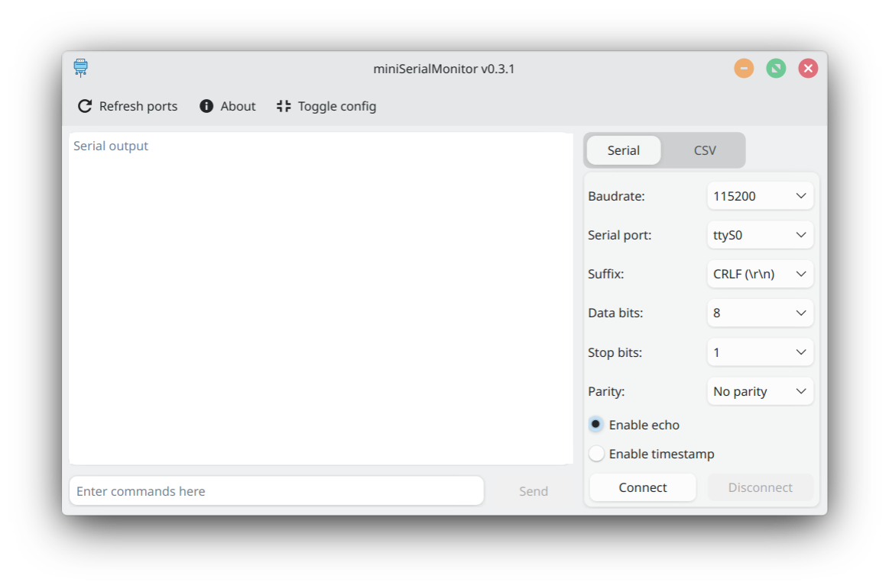

# Mini Serial Monitor

Minimalistic serial monitor written in C++

---



# Features:

- Minimalistic design

- Saving output to csv file

 

## Build Prerequisites

Make sure you have the following installed on your system:

* Git
* CMake
* C++ Compiler (e.g., GCC or Clang)
* Qt Development Packages (including Qt SerialPort)

On Debian/Ubuntu-based Linux distributions, you can install the necessary dependencies using:

```bash
# Update package list and install build essentials, CMake, and Qt6 dependencies

sudo apt update
sudo apt install build-essential cmake qt6-base-dev qt6-serialport-dev -y

# Clone the repository
git clone [https://github.com/kurson95/miniSerialMonitor.git](https://github.com/kurson95/miniSerialMonitor.git)

# Navigate to the project directory
cd miniSerialMonitor

# Create a dedicated build directory and enter it
mkdir build
cd build

# Generate the build system files using CMake
cmake ..

# Compile the source code
make
```

You can also download precompiled appimage from releases.
